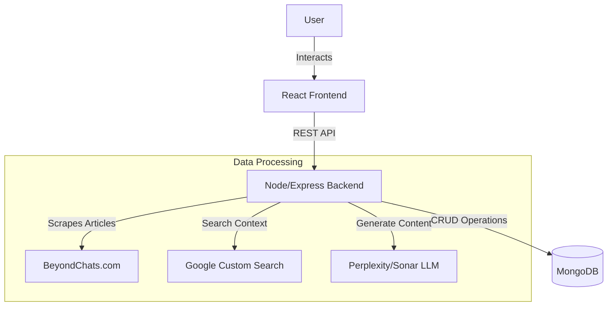

# Article Enhancer 

A full-stack application to scrape blog articles, view them, and enhance them using AI .

## Features

- **Article Scraping**: Automatically fetch and store blog articles from BeyondChats.com.
- **AI Enhancement**: Enhance articles using LLMs (Sonar/Perplexity) by synthesizing content with real-time references from Google Search.
- **Comparison View**: Clean dashboard to view "Original" vs "AI Enhanced" versions side-by-side.
- **Automated Workflow**: Simple one-click actions to fetch and enhance articles.
- **Responsive UI**: Modern, light-themed interface built with React.

## Live Demo

Check out the live version of the project here: (https://article-enhancer.vercel.app/)
## Tech Stack

### Client

- **Framework**: React 19 + Vite
- **Styling**: CSS (Custom clean design)
- **State Management**: React Hooks

### Server

- **Runtime**: Node.js
- **Framework**: Express.js
- **Database**: MongoDB (via Mongoose)
- **Scraping**: Cheerio
- **AI/Search**: Perplexity (Sonar) API & Google Custom Search API

## Project Structure

```
├── client/                 # Frontend React Application
│   ├── src/
│   │   ├── components/     # UI Components
│   │   ├── hooks/          # Custom Hooks (useArticles)
│   │   ├── App.jsx         # Main Application Logic
│   │   └── App.css         # Styling
│   └── ...
├── server/                 # Backend Node.js Application
│   ├── models/             # Mongoose Models (Article)
│   ├── routes/             # API Routes
│   ├── scripts/            # Scraper & Enhancer Logic
│   └── ...
└── README.md
```

## Architecture & Data Flow

Below is the high-level architecture of the system:



## Setup & Installation

### Prerequisites

- Node.js (v18+)
- MongoDB Database

### 1. Server Setup

Navigate to the server directory and install dependencies:

```bash
cd server
npm install
```

Create a `.env` file in the `server` directory with the following variables:

```env
PORT=5000
MONGO_URI=your_mongodb_connection_string
GOOGLE_API_KEY=your_google_search_api_key
GOOGLE_CX=your_google_custom_search_context_key
SONAR_API_KEY=your_perplexity_sonar_api_key
BACKEND_BASE_URL=http://localhost:5000
```

Start the backend server:

```bash
npm run dev
```

### 2. Client Setup

Navigate to the client directory and install dependencies:

```bash
cd client
npm install
```

Create a `.env` file in the `client` directory:

```env
VITE_API_URL=http://localhost:5000
```

Start the frontend development server:

```bash
npm run dev
```

## Usage

1.  Open the application (default: `http://localhost:5173`).
2.  **Fetch Article**: Click the "Fetch Article" button to scrape a new article.
3.  **View & Read**: Click any article card to read the full content.
4.  **Enhance Article**: Click "Enhance Article" to process pending articles using AI.
5.  **Delete**: Hover over an article and click the trash icon 🗑️ to remove it.

## API Endpoints

### Articles (`/api/articles`)

- `GET /api/articles`: Retrieve all articles.
- `GET /api/articles/:id`: Retrieve a specific article by ID.
- `POST /api/articles`: Create a new article manually.
- `PUT /api/articles/:id`: Update an existing article.
- `DELETE /api/articles/:id`: Delete an article.

### Scripts (`/api/scripts`)

- `POST /api/scripts/scrape`: Trigger the background scraping process to fetch new articles.
- `POST /api/scripts/enhance`: Trigger the AI enhancement process for pending articles.
